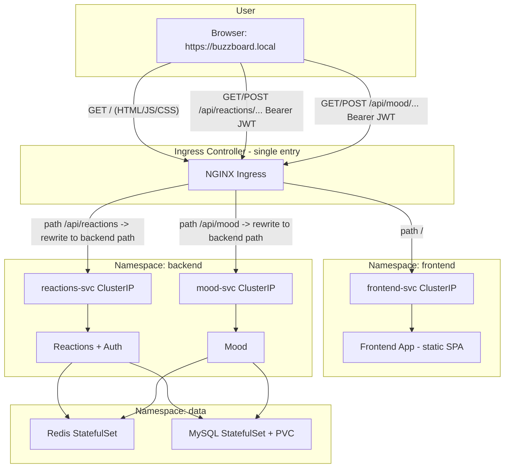

# 3-Tier Containerized App with Kubernetes (Student Project)

## Architecture Overview

**Exposed architecture (how users and the browser see it):** One HTTPS host (**buzzboard.local**). The **Ingress controller** (e.g. NGINX) is the single entry point: it terminates TLS and routes by path to the right Service. The **browser** never talks to ClusterIPs directly; it always talks to the same origin.




**Path-based routing (what is actually exposed):**


| Path                                                                             | Ingress routes to                                                                   | Namespace |
| -------------------------------------------------------------------------------- | ----------------------------------------------------------------------------------- | --------- |
| `/` (and static assets)                                                          | **frontend-svc** (port 80)                                                          | frontend  |
| `/api/reactions` (e.g. `/api/reactions/reactions`, `/api/reactions/auth/signin`) | **reactions-svc** (port 8080); path rewritten to `/reactions`, `/auth/signin`, etc. | backend   |
| `/api/mood` (e.g. `/api/mood/mood`)                                              | **mood-svc** (port 8080); path rewritten                                            | backend   |


The frontend SPA is configured with `REACTIONS_SVC_URL=/api/reactions` and `MOOD_SVC_URL=/api/mood` so the **browser** sends all API requests to the **same host**; the Ingress controller forwards them to the correct backend Service. TLS secret (`ingress-tls`) is in **frontend** and **backend** namespaces (both Ingress resources use the same host and TLS).

- **Tier 1 (frontend):** Serves the static app (HTML, JS, CSS) with **menu bar** (Sign in, Sign up when logged out; Reaction Wall, Mood, Hello username, Log out when logged in). The **browser** runs the app and sends API calls to **same origin** (`/api/reactions`, `/api/mood`) with **Bearer JWT**. Sign-in is required for both posting reactions and voting mood. UI/UX: professional and exciting (clear hierarchy, responsive, smooth interactions, modern typography, skip link, footer with contact, animations with reduced-motion support).
- **Tier 2 (backend):** **2 microservices only** — **Reactions** (auth + reactions with `user_id`) and **Mood** (mood_votes with `user_id`). They are **reached by the Ingress** on paths `/api/reactions` and `/api/mood`; they can call each other via Service DNS in the same namespace. Both use Redis and MySQL in the data namespace. **JWT_SECRET** is shared (Secret) so Mood can verify tokens issued by Reactions.
- **Tier 3 (data):** Redis and MySQL as **StatefulSets** (headless Services); MySQL holds `users`, `reactions`, `mood_votes`. StorageClass with `reclaimPolicy: Retain` for MySQL PVCs. No HPA in this namespace.

**Communication rule (mandatory):** All components call each other **only via Kubernetes Services** (ClusterIP or headless). The **browser** reaches the app and APIs **only through the Ingress** (same host, path-based). **Backend microservices** call Redis/MySQL via Service DNS (e.g. `redis-svc.data.svc.cluster.local`, `mysql-svc.data.svc.cluster.local`) and can call each other via `reactions-svc.backend.svc.cluster.local` / `mood-svc.backend.svc.cluster.local`.

---

## 1. Application: Multi-Service Product (A Bit Funny, Sellable to Any Company)

**Product name (example):** *Buzz Board* or *Office Vibes* — a **multi-service** product that can be implemented or sold to any company. Tone: **a little bit funny**, light and playful so it feels human, not corporate.

**Exactly 2 services (simple for students):** The product exposes **only 2 services** that companies can enable or buy:

1. **Reaction Wall** — Post short messages or pick emoji reactions; **each post is recorded with the user** who posted it. Live wall, persistent in DB, cached in Redis. (Database + cache effect visible.)
2. **Mood of the Day** — One tap: "How's the room today?" (e.g. 😴 / 😐 / 🔥). **Each vote is recorded with the user** who voted. Results stored in MySQL, today’s tally cached in Redis. Funny labels optional (e.g. "Mostly surviving").

*(Only 2 services — removed Confetti/Kudos and Quick Poll to keep it simple for students.)* "You made someone’s day." 
**Product branding:** App title and header: **"Ashour Chat Tutorial"**. One **menu bar** connects the whole app: when logged out, menu shows **Sign in** and **Sign up**; when logged in, menu shows **Reaction Wall**, **Mood of the Day**, **Hello, username**, and **Log out**. Sign-in is required for **both** using Reaction Wall and Mood (no anonymous posts or votes).

**Auth and users:** **Reactions** service owns **signup** and **signin** (users table in MySQL, JWT issued). **Mood** service verifies the same JWT (shared **JWT_SECRET**) and stores `user_id` with each vote. Frontend stores JWT (e.g. localStorage), sends `Authorization: Bearer <token>` on all API calls to both services. Both Reaction Wall and Mood are **gated by auth** (menu shows them only when signed in).

Backend = **2 microservices only**: **Reactions** (auth + reactions with user_id) and **Mood** (mood_votes with user_id) — each a **separate Deployment** and **ClusterIP Service**; they call **each other** via svc in the same namespace with **API calls**. Frontend calls both backend Services directly (no gateway). Both use Redis and MySQL in the data namespace.

**Value proposition:** Internal engagement or feedback — **fun, approachable** feel, with **professional, exciting UI/UX** so the app feels polished and enjoyable to use. Hosted or on-prem; white-label friendly. **Implementable** and **sellable** (e.g. "Buzz Board — reactions and mood in one").

**Tech (for learning and production):**

- **Frontend:** One app with a **single menu bar** (Sign in | Sign up when logged out; Reaction Wall | Mood of the Day | Hello, username | Log out when logged in). Header: **"Ashour Chat Tutorial"**. **Auth clarity:** when logged out, show "Sign in so your reactions and mood are recorded with your name"; when logged in, show a **Signed in as &lt;username&gt;** badge. Calls **both** backend Services with **Authorization: Bearer &lt;JWT&gt;** (REACTIONS_SVC_URL, MOOD_SVC_URL in ConfigMap). Reaction list shows **@username** per post. **Professional, exciting UI/UX:** clear visual hierarchy, responsive layout, smooth transitions, **success toasts** (e.g. after post/vote), **loading spinners**, auth card icons and descriptions, signed-in badge, hover/active states, empty states with friendly copy; the whole app (menu, Reaction Wall, Mood) should feel cohesive and enjoyable.
- **Backend (2 microservices only):** **Reactions** — signup/signin (users table, JWT), GET/POST reactions with **user_id** and optional username in response; **Mood** — JWT verification, POST mood with **user_id**. Each = one Deployment + one ClusterIP Service; they call each other via Service DNS. Each: Redis first, then MySQL; return source and latency. ConfigMaps: REDIS_HOST, MYSQL_HOST, **JWT_SECRET** (shared), and the other backend svc URL.
- **Redis:** Cache for both (recent reactions, mood tally); optional TTL.
- **MySQL:** Tables **users** (id, username, password_hash, created_at), **reactions** (id, message, user_id, created_at), **mood_votes** (id, mood, user_id, created_at). Each microservice connects via Secrets.

Students still feel the **database effect** and **cache effect** across **2 funny, sellable services** in one product.

---

## 2. Project Layout (current)

```
project-root/
├── frontend/
│   ├── Dockerfile
│   ├── nginx.conf
│   └── public/
│       ├── index.html
│       ├── app.js
│       ├── styles.css
│       ├── config.js
│       ├── config.docker.js
│       └── config.local.js
├── backend/
│   ├── reactions/
│   │   ├── Dockerfile
│   │   ├── package.json
│   │   ├── package-lock.json
│   │   └── server.js
│   └── mood/
│       ├── Dockerfile
│       ├── package.json
│       ├── package-lock.json
│       └── server.js
├── k8s/
│   ├── namespace-1-frontend/
│   │   ├── namespace.yaml
│   │   ├── ingress.yaml
│   │   ├── frontend-deployment.yaml
│   │   ├── frontend-service.yaml
│   │   ├── frontend-configmap.yaml
│   │   ├── frontend-secret.yaml
│   │   └── frontend-networkpolicy.yaml
│   ├── namespace-2-backend/
│   │   ├── namespace.yaml
│   │   ├── ingress.yaml
│   │   ├── reactions-deployment.yaml   # Deployment + Service (reactions-svc) in same file
│   │   ├── reactions-configmap.yaml
│   │   ├── reactions-secret.yaml
│   │   ├── mood-deployment.yaml       # Deployment + Service (mood-svc) in same file
│   │   ├── mood-configmap.yaml
│   │   ├── mood-secret.yaml
│   │   ├── backend-networkpolicy.yaml
│   │   └── backend-hpa.yaml
│   ├── namespace-3-data/
│   │   ├── namespace.yaml
│   │   ├── storageclass.yaml
│   │   ├── redis-statefulset.yaml     # StatefulSet + Service in same file
│   │   ├── redis-configmap.yaml
│   │   ├── redis-secret.yaml
│   │   ├── redis-networkpolicy.yaml
│   │   ├── mysql-statefulset.yaml     # StatefulSet + Service in same file
│   │   ├── mysql-configmap.yaml
│   │   ├── mysql-secret.yaml
│   │   └── mysql-networkpolicy.yaml
│   ├── ssl/
│   │   └── README.md
│   └── README.md
├── docker-compose.yml
└── README.md
```

---

## 3. SSL Certificate (OpenSSL) and Ingress

- You create the cert with OpenSSL (e.g. self-signed). Steps in `k8s/ssl/README.md`:
  - Generate key and cert (e.g. `openssl req -x509 -nodes -days 365 -newkey rsa:2048 -keyout tls.key -out tls.crt -subj "/CN=buzzboard.local"`).
  - Create TLS Secret **in both frontend and backend** namespaces (both Ingress resources use the same host and need TLS):  
  `kubectl create secret tls ingress-tls --cert=tls.crt --key=tls.key -n frontend` and same for `-n backend`.
- **Two Ingress resources, same host (exposed architecture):**
  - **Frontend namespace:** Ingress for host `buzzboard.local`, path `/` → frontend-svc:80. TLS `secretName: ingress-tls`.
  - **Backend namespace:** Ingress for same host `buzzboard.local`, paths `/api/reactions` and `/api/mood` → reactions-svc and mood-svc:8080, with rewrite so backend receives e.g. `/reactions`, `/auth/signin`, `/mood`. TLS `secretName: ingress-tls`.

The Ingress controller (e.g. NGINX) merges both Ingresses by host; the browser always uses the same origin ([https://buzzboard.local](https://buzzboard.local)). No cert files in repo; only instructions and manifest references to `ingress-tls`.

---

## 4. Namespace 1: Ingress + Frontend


| Resource          | Purpose                                                                                                                                                   |
| ----------------- | --------------------------------------------------------------------------------------------------------------------------------------------------------- |
| **Namespace**     | `frontend`                                                                                                                                                |
| **Ingress**       | Same host (e.g. `buzzboard.local`); path **/** only → frontend-svc:80. HTTPS with TLS secret `ingress-tls`. API paths are in backend Ingress.             |
| **Deployment**    | Frontend image (static SPA); config.js mounted from ConfigMap so browser gets `REACTIONS_SVC_URL=/api/reactions`, `MOOD_SVC_URL=/api/mood` (same-origin). |
| **Service**       | ClusterIP **frontend-svc**; Ingress targets this for `/`.                                                                                                 |
| **ConfigMap**     | Mounted as **config.js** so browser uses `/api/reactions` and `/api/mood` (same host); frontend sends Bearer JWT on those paths.                          |
| **Secret**        | Sensitive env (if any). TLS secret `ingress-tls` created separately (see ssl/README).                                                                     |
| **NetworkPolicy** | Ingress from Ingress controller on port 80; Egress as needed.                                                                                             |


---

## 5. Namespace 2: Backend — 2 Microservices Only (+ HPA + Ingress for API paths)

**Backend = 2 microservices only:** **Reactions** and **Mood**. Each is a **separate Deployment** and **separate ClusterIP Service**. They are **exposed to the browser** via an **Ingress** in this namespace: same host (`buzzboard.local`), paths **/api/reactions** and **/api/mood** route to reactions-svc and mood-svc (with path rewrite). The **browser** sends API requests to those paths (same origin); the **Ingress controller** forwards to the correct Service. Backend microservices can call **each other** via Service DNS in the same namespace; each talks to Redis and MySQL in the data namespace.


| Resource          | Purpose                                                                                                                                                                                                                  |
| ----------------- | ------------------------------------------------------------------------------------------------------------------------------------------------------------------------------------------------------------------------ |
| **Namespace**     | `backend`                                                                                                                                                                                                                |
| **Ingress**       | Same host as frontend; paths **/api/reactions** and **/api/mood** → reactions-svc and mood-svc:8080; rewrite so backend receives e.g. `/reactions`, `/auth/signin`, `/mood`. TLS secret `ingress-tls` in this namespace. |
| **Deployments**   | **2 only:** reactions, mood; each its own image and env.                                                                                                                                                                 |
| **Services**      | **2 ClusterIP:** reactions-svc, mood-svc. Reached by Ingress (path-based); they call each other via these svc DNS.                                                                                                       |
| **ConfigMap**     | Per microservice: REDIS_HOST, MYSQL_HOST (data ns), JWT_SECRET (shared), other backend svc URL.                                                                                                                          |
| **Secret**        | Per microservice: MYSQL_USER, MYSQL_PASSWORD, REDIS_PASSWORD, **JWT_SECRET** (shared).                                                                                                                                   |
| **NetworkPolicy** | Ingress from **Ingress controller namespace** (so API requests from Ingress reach backend); Ingress from same namespace (backend-to-backend); Egress to data (Redis, MySQL).                                             |
| **HPA**           | Horizontal Pod Autoscaler for reactions (e.g. CPU-based, min 1, max 5).                                                                                                                                                  |


---

## 6. Namespace 3: Redis + MySQL (no HPA; all databases as StatefulSet)

- **StorageClass:** One StorageClass (e.g. `standard-retain`) with `reclaimPolicy: Retain` so that when the MySQL StatefulSet is deleted, the PVCs and data are retained and can be bound again by a new StatefulSet.
- **No HPA** in this namespace; only backend namespace has HPA.
- **All databases** (Redis and MySQL) are created as **StatefulSets**, not Deployments. Headless Services are used for discovery; apps call the Service only.

**Redis:**


| Resource          | Purpose                                                                                                 |
| ----------------- | ------------------------------------------------------------------------------------------------------- |
| **StatefulSet**   | Redis image; config from ConfigMap; password from Secret; optional volumeClaimTemplate for persistence. |
| **Service**       | Headless (`clusterIP: None`); backend uses `redis-svc.data.svc.cluster.local`.                          |
| **ConfigMap**     | Optional Redis config (e.g. `redis.conf` or env).                                                       |
| **Secret**        | Redis password.                                                                                         |
| **NetworkPolicy** | Ingress from backend namespace only; Egress as needed (e.g. to MySQL if Redis talks to it, or none).    |


**MySQL:**


| Resource          | Purpose                                                                                                                          |
| ----------------- | -------------------------------------------------------------------------------------------------------------------------------- |
| **StatefulSet**   | MySQL image; `MYSQL_ROOT_PASSWORD` and DB name from Secret/ConfigMap; volumeMount for `/var/lib/mysql` from volumeClaimTemplate. |
| **Service**       | Headless; backend uses `mysql-svc.data.svc.cluster.local`.                                                                       |
| **ConfigMap**     | e.g. `MYSQL_DATABASE`.                                                                                                           |
| **Secret**        | `MYSQL_ROOT_PASSWORD`, `MYSQL_USER`, `MYSQL_PASSWORD`.                                                                           |
| **NetworkPolicy** | Ingress from backend namespace only; Egress none (or to Redis if needed).                                                        |
| **PVC**           | Via StatefulSet `volumeClaimTemplates` with `storageClassName: <retain-storageclass>`; size e.g. 2Gi; reclaimPolicy: Retain.     |


Important: Use a StorageClass with `reclaimPolicy: Retain`. If your cluster’s default uses `Delete`, create a custom StorageClass. Then when the MySQL StatefulSet is recreated, it can bind to the same retained PVCs and data persists.

---

## 7. NetworkPolicy Summary

- **Namespace 1 (frontend):** Allow Ingress from Ingress controller (so `/` can reach frontend-svc); Egress as needed.
- **Namespace 2 (backend):** Allow Ingress from **Ingress controller namespace** (so `/api/reactions` and `/api/mood` requests from the Ingress can reach reactions-svc and mood-svc) and **from same namespace** (backend-to-backend via svc); Egress to namespace 3 (Redis, MySQL).
- **Namespace 3 (data):** Allow Ingress from namespace 2 (backend) to Redis and MySQL; no cross-talk required unless you design Redis → MySQL.

Use `namespaceSelector` (e.g. label Ingress controller namespace with `app.kubernetes.io/name=ingress-nginx`) so the exposed path-based routing works.

---

## 8. Implementation Order

1. **Scaffold app code:** Frontend; **2 backend microservices** (reactions, mood — each a separate app that calls the other via backend svc DNS and uses Redis/MySQL).
2. **Docker:** Dockerfiles for frontend and for **both** backend microservices (reactions, mood); Redis and MySQL use official images.
3. **K8s base:** Create three namespaces and the StorageClass (Retain).
4. **Namespace 3:** StorageClass (Retain), then Redis + MySQL as **StatefulSets** (Headless Service, ConfigMap, Secret, NetworkPolicy). MySQL StatefulSet uses volumeClaimTemplates with the retain StorageClass; no HPA in this namespace.
5. **Namespace 2:** Backend — **2 microservices only** (reactions, mood): one Deployment + one ClusterIP Service + ConfigMap + Secret each; they call each other via svc in same namespace; NetworkPolicy allows frontend + backend-to-backend; HPA on one or both.
6. **Namespace 1:** Frontend (Deployment, ClusterIP, ConfigMap, Secret, NetworkPolicy), then Ingress and TLS secret (document OpenSSL in `k8s/ssl/README.md`).
7. **README:** How to build images, push to a registry, deploy namespaces in order, create TLS secret, and verify (browser HTTPS, backend health, Redis/MySQL connectivity). Include a note on testing PVC retain: delete MySQL StatefulSet, recreate, confirm PVCs re-bound and data intact.

---

## 9. Files to Add (Summary)

- **App:** `frontend/` (Dockerfile, nginx.conf, public/: index.html, app.js, styles.css, config.js, config.docker.js, config.local.js), `backend/reactions/` (server.js, Dockerfile, package.json), `backend/mood/` (server.js, Dockerfile, package.json).
- **K8s:** All YAML under `k8s/namespace-1-frontend/` (namespace, ingress, frontend-deployment, frontend-service, frontend-configmap, frontend-secret, frontend-networkpolicy), `namespace-2-backend/` (namespace, ingress, reactions-deployment.yaml and mood-deployment.yaml — each file contains both Deployment and ClusterIP Service — plus reactions/mood-configmap, reactions/mood-secret, backend-networkpolicy, backend-hpa), `namespace-3-data/` (namespace, storageclass, redis/mysql statefulset+service+configmap+secret+networkpolicy in separate files per resource type), plus `k8s/ssl/README.md`.
- **Root:** `README.md`, `docker-compose.yml`.

---

## 10. Enhancement: Auth, User-Linked Data, Menu Bar, UI

- **Sign-in for both:** Posting a reaction and voting for mood **both require** the user to be signed in. No anonymous posts or votes.
- **Auth clarity in the UI:** When logged out, the app shows a short line: **"Sign in so your reactions and mood are recorded with your name. New? Sign up first."** When logged in, a **"Signed in as &lt;username&gt;"** badge (pill with status dot) is shown so users see that their actions are attributed. Sign-in and Sign-up cards include one-line descriptions; **only one auth panel is visible at a time** (Sign in or Sign up), with nav tabs and in-form links to switch; CSS ensures inactive panels are hidden via `.panel { display: none !important }` and `.panel.active.auth-panel { display: flex !important }`.
- **Menu bar:** One navigation bar for the whole app. **Logged out:** Sign in | Sign up only. **Logged in:** Reaction Wall | Mood of the Day | Hello, username | Log out. Reaction Wall and Mood are only visible/usable when signed in. Active tab gets `aria-current="page"` for accessibility.
- **Users and JWT:** Reactions service provides **signup** and **signin** (users table, bcrypt for passwords, JWT). Mood service **verifies** the same JWT (shared **JWT_SECRET**) and stores `user_id` with each vote. Frontend sends `Authorization: Bearer <token>` on every request to both services. **No separate "auth service"** — signup/signin are endpoints in the Reactions service.
- **User on each record:** Each **reaction** row has `user_id` (and GET returns username); each **mood_vote** row has `user_id`. Frontend displays **@username** next to each reaction (and empty state says posts are saved with the user's name). **Mood of the Day** page shows a personalized greeting: **"How's the room today, &lt;username&gt;? Your vote is recorded with your account."** (username filled from `getUser()` when loading the mood view.)
- **Branding and UI/UX:** App title and main heading: **"Ashour Chat Tutorial"**. **Professional, exciting UI/UX** is a requirement: clear visual hierarchy, responsive design, smooth transitions and loading/error feedback, modern typography, consistent spacing and cards, accessible contrast and focus states.
- **Implemented UI/UX:** Success and **error toasts** (green for success, red for errors; `showToast(id, message, duration, type)`); loading spinners and **disabled/loading states** on Sign in, Sign up, Post, and Mood buttons; **robust API handling** (`apiFetch` with safe JSON parse, network error handling, user-facing error messages); **skip link** ("Skip to main content"); **footer** with Contact: email (mailto), phone (tel), LinkedIn (link, opens in new tab); **animations**: header fade-in, card fade-in on panel active, staggered item fade-in for reaction list, footer fade-in; **prefers-reduced-motion** respected (animations disabled). Auth card icons and descriptions; signed-in badge with pulse dot; hover/active states; empty states; min tap targets (44px); `aria-live`, `aria-current`, labels. Menu bar, Reaction Wall, and Mood screens are cohesive and enjoyable to use.

---

## 11. Clarifications Resolved in Plan

- **Service-only communication:** All components call each other **only through Services** (ClusterIP or headless). **Backend microservices** call each other **only via ClusterIP Services (svc) in the same namespace**, with API calls in the background — never by Deployment or pod name.
- **HPA:** Horizontal Pod Autoscaler in **backend namespace only** (scales backend Deployment by CPU or custom metric).
- **SSL:** You create the cert with OpenSSL; the plan only references a K8s TLS secret and documents the OpenSSL steps.
- **Database namespace:** No HPA; Redis and MySQL are **StatefulSets** (not Deployments). Communication is via Services only. MySQL holds **users**, **reactions** (with user_id), and **mood_votes** (with user_id).
- **Retain:** StorageClass with `reclaimPolicy: Retain`; MySQL StatefulSet uses volumeClaimTemplates; reuse of PVCs after StatefulSet restart is the intended test.
- **Auth:** Sign-in required for both Reaction Wall and Mood; single menu bar connects auth and the two features; JWT issued by Reactions, verified by Mood via shared JWT_SECRET.

If you want a different stack (e.g. Python backend instead of Node, or no React), say which and the plan can be adjusted before implementation.

---

## 12. Implementation status (plan edits carried to code)

The following plan edits have been implemented in the repo:


| Plan requirement                                             | Where implemented                                                                                                                                                                                                                                                                                                                 |
| ------------------------------------------------------------ | --------------------------------------------------------------------------------------------------------------------------------------------------------------------------------------------------------------------------------------------------------------------------------------------------------------------------------- |
| **Ashour Chat Tutorial** branding                            | `frontend/public/index.html` (title, `.site-title`), `README.md`                                                                                                                                                                                                                                                                  |
| **Menu bar:** Sign in, Sign up, Reaction Wall, Mood, Log out | `frontend/public/index.html`: nav with `.menu-btn[data-view]`; `app.js`: `showView()`, active tab `aria-current="page"`                                                                                                                                                                                                           |
| **Sign-in required** for both Reaction Wall and Mood         | `backend/reactions/server.js` (`requireAuth` on POST /reactions), `backend/mood/server.js` (`requireAuth` on POST /mood); frontend sends Bearer token and clears auth + shows Sign in on 401                                                                                                                                      |
| **Signup / Signin** (users table, bcrypt, JWT)               | `backend/reactions/server.js`: POST /auth/signup, POST /auth/signin; `users` table; frontend signin/signup forms, loading states, `localStorage` token                                                                                                                                                                            |
| **user_id on reactions and mood_votes**                      | `backend/reactions/server.js`: `reactions.user_id`, GET joins `username`; `backend/mood/server.js`: `mood_votes.user_id`; tables created in initMysql                                                                                                                                                                             |
| **Mood verifies JWT** (shared JWT_SECRET)                    | `backend/mood/server.js`: `requireAuth`; JWT_SECRET in docker-compose and K8s secrets and both deployments                                                                                                                                                                                                                        |
| **Frontend:** Bearer on all API calls, username per reaction | `frontend/public/app.js`: `authHeaders()`, `apiFetch()`; reaction list shows `@username` (`.reaction-meta`)                                                                                                                                                                                                                       |
| **Auth clarity in UI**                                       | `frontend/public/index.html`: auth explainer when logged out; **Signed in as &lt;username&gt;** badge when logged in; auth card icons and descriptions; **only one auth panel visible** (Sign in or Sign up) via `.panel` / `.panel.active.auth-panel` in `styles.css`                                                            |
| **Mood of the Day with username**                            | `frontend/public/index.html`: `.mood-greeting` with `<strong id="mood-username">`; `app.js` `loadMood()` sets username from `getUser()`; `styles.css`: `.mood-greeting strong` accent color                                                                                                                                       |
| **Robust API and loading/error UX**                          | `frontend/public/app.js`: `apiFetch()` (safe JSON, network catch); `setButtonLoading()` on Sign in, Sign up, Post, Mood; error toasts `showToast(..., 'error')`; null guards; user-facing error messages                                                                                                                          |
| **Professional UI/UX**                                       | `frontend/public/styles.css`: Outfit font, cards, `.toast-success`/`.toast-error`, spinner, signed-in badge, loading/empty states, **skip link**, **footer** (email, phone, LinkedIn), **animations** (headerFadeIn, cardFadeIn, itemFadeIn staggered, footerFadeIn), `prefers-reduced-motion`; `app.js`: `showToast()` with type |
| **Docker + K8s:** Services in same file as Deployment        | `docker-compose.yml`; `k8s/namespace-2-backend/`: reactions-deployment.yaml and mood-deployment.yaml each contain Deployment + ClusterIP Service; reactions-secret.yaml, mood-secret.yaml                                                                                                                                         |


To see the new UI after pulling or editing frontend/backend: run `docker-compose build --no-cache frontend reactions mood` then `docker-compose up -d`, and hard-refresh the browser at [http://localhost:3001](http://localhost:3001).