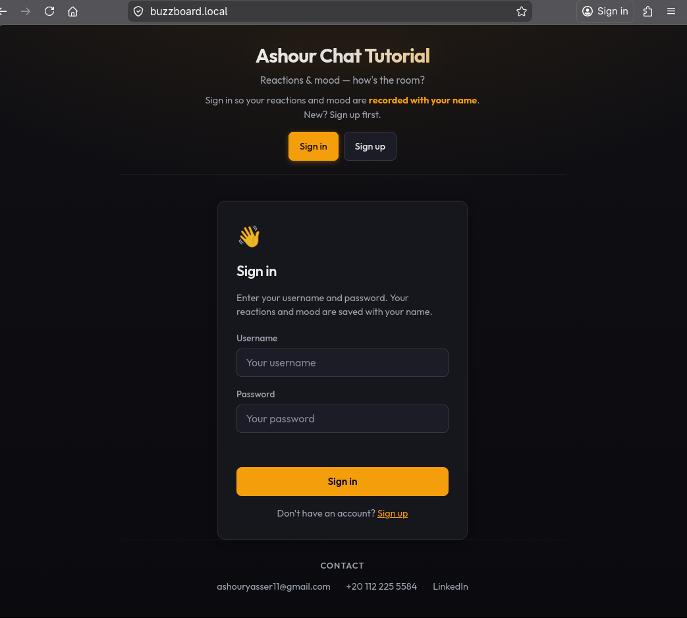
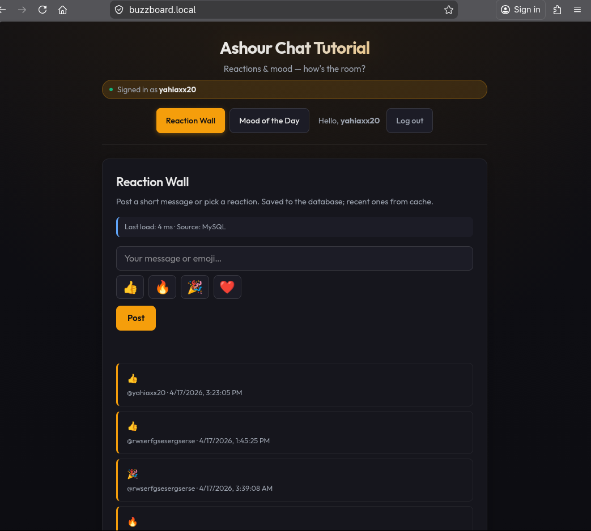
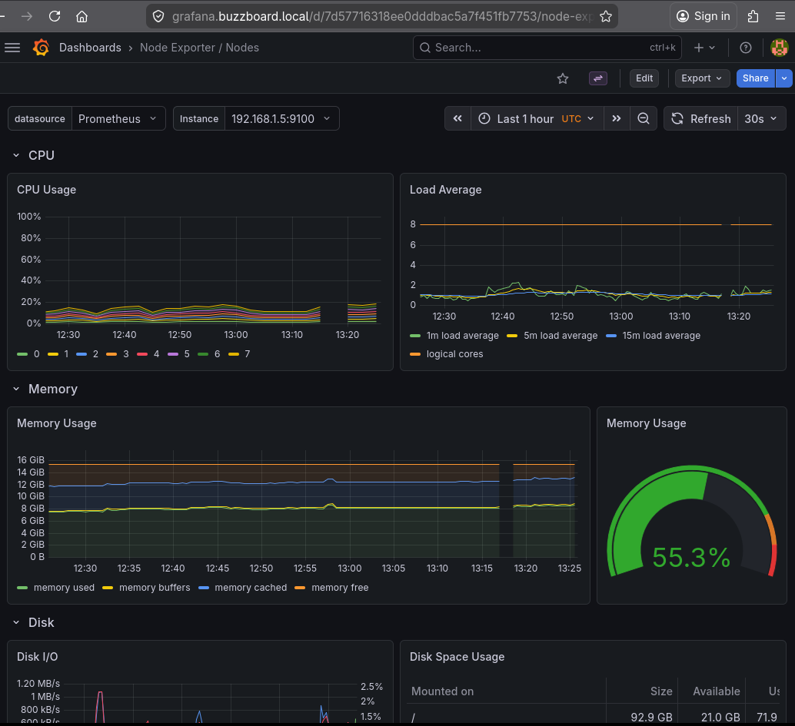
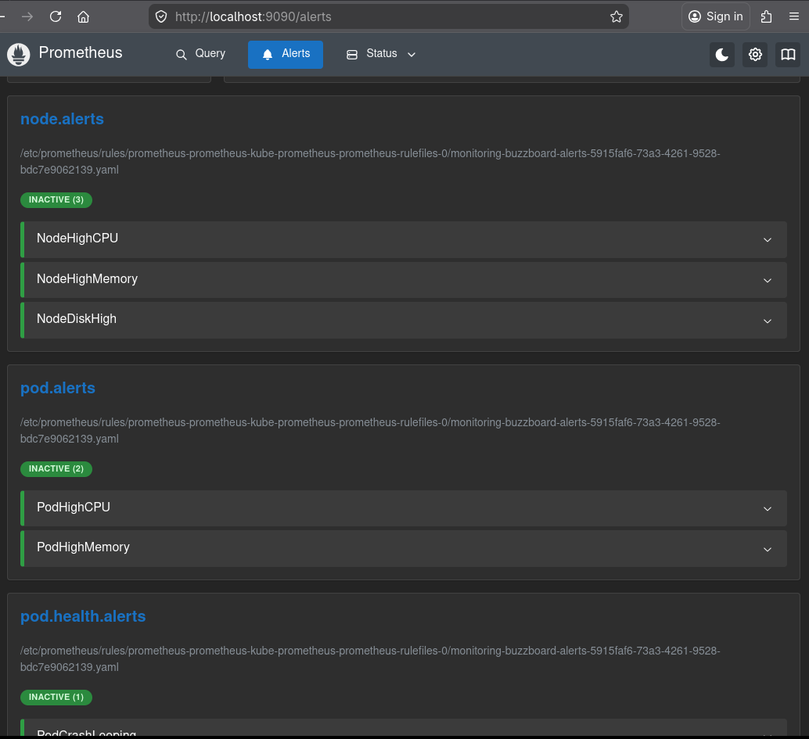

<div align="center">

# 🚀 BuzzBoard — Full DevOps Pipeline on k3s

**A production-grade 3-tier microservices application — fully containerized,
orchestrated on Kubernetes, monitored with Prometheus & Grafana,
and secured with TLS.**

[](https://kubernetes.io)
[](https://k3s.io)
[](https://docker.com)
[](https://prometheus.io)
[](https://grafana.com)
[](https://nodejs.org)
[](https://mysql.com)
[](https://redis.io)
[](https://nginx.com)
[](https://fedoraproject.org)

[View on Docker Hub](https://hub.docker.com/u/yahiaxx20) · [LinkedIn](https://www.linkedin.com/in/yahia-hamdy-676591204)

</div>

---

## 📸 Screenshots

<div align="center">

| App Homepage | Reaction Wall |
|:---:|:---:|
|  |  |

| Grafana Dashboard | Prometheus Alerts |
|:---:|:---:|
|  |  |

</div>

---

## 🏗️ Architecture

                    ┌─────────────────────────────────┐
                    │         BROWSER (User)           │
                    └────────────┬────────────────────┘
                                 │ HTTPS
                    ┌────────────▼────────────────────┐
                    │   Traefik Ingress Controller     │
                    │   TLS Termination (self-signed)  │
                    └────┬──────────────────┬─────────┘
                         │                  │
           buzzboard.local            reactions/mood
                         │            .buzzboard.local
             ┌───────────▼──────────────────▼────────┐
             │         NAMESPACE: frontend            │
             │   Nginx (static HTML/CSS/JS)           │
             │   ConfigMap → config.js (API URLs)     │
             └───────────────────────────────────────┘
                         │ Browser JS fetch()
          ┌──────────────┴──────────────────┐
          │                                  │

┌─────────────▼──────────────┐ ┌──────────────▼─────────────┐ │ NAMESPACE: backend │ │ NAMESPACE: backend │ │ Reactions Service :8081 │ │ Mood Service :8082 │ │ ✅ Auth (signup/signin) │ │ ✅ Mood votes │ │ ✅ Reaction Wall │ │ ✅ JWT verification │ │ ✅ JWT signing │ │ HPA: 1-5 replicas │ │ HPA: 1-5 replicas │ └──────────────┬─────────────┘ └─────────────┬──────────────┘ │ └──────────────┬──────────────────┘ │ Both backends connect here ┌──────────────▼──────────────────────────┐ │ NAMESPACE: data │ │ ┌─────────────────┐ ┌────────────────┐ │ │ │ MySQL 8.0 │ │ Redis 7 │ │ │ │ StatefulSet │ │ StatefulSet │ │ │ │ PVC: Retain │ │ Cache Layer │ │ │ │ users table │ │ TTL: 60s │ │ │ │ reactions table│ │ │ │ │ │ mood_votes │ └────────────────┘ │ │ └─────────────────┘ │ └─────────────────────────────────────────┘

          ┌─────────────────────────────────────────┐
          │         NAMESPACE: monitoring            │
          │  Prometheus → scrapes all namespaces     │
          │  Grafana    → dashboards + visualization │
          │  Alertmanager → Gmail alerts at >75% CPU │
          │  Node Exporter → host OS metrics         │
          └─────────────────────────────────────────┘


---

## 🛠️ Tech Stack

| Layer | Technology | Purpose |
|-------|-----------|---------|
| **Orchestration** | k3s v1.34 | Lightweight production Kubernetes |
| **Container Runtime** | containerd | Container execution |
| **Ingress** | Traefik | HTTP/HTTPS routing + TLS termination |
| **Frontend** | Nginx + HTML/CSS/JS | Static file serving |
| **Backend** | Node.js + Express | REST API microservices |
| **Auth** | JWT (jsonwebtoken) | Stateless authentication |
| **Password Hashing** | bcrypt | Secure password storage |
| **Primary Database** | MySQL 8.0 | Persistent data storage |
| **Cache Layer** | Redis 7 | Read-through caching (TTL: 60s) |
| **Monitoring** | Prometheus + Grafana | Metrics + dashboards |
| **Alerting** | Alertmanager + Gmail | CPU/RAM alerts via email |
| **Node Metrics** | Node Exporter | Host-level OS metrics |
| **Container Registry** | Docker Hub | Image storage |
| **TLS** | OpenSSL (self-signed) | HTTPS encryption |
| **OS** | Fedora Linux | Host operating system |

---

## 📁 Project Structure

buzzboard-k8s/ ├── backend/ │ ├── mood/ # Mood voting microservice (Node.js :8082) │ │ ├── Dockerfile │ │ ├── server.js │ │ └── package.json │ └── reactions/ # Reactions + Auth microservice (Node.js :8081) │ ├── Dockerfile │ ├── server.js │ └── package.json ├── frontend/ # Static UI served by Nginx │ ├── Dockerfile │ ├── nginx.conf │ └── public/ ├── k8s/ │ ├── namespace-1-frontend/ # Nginx deployment, service, ingress │ ├── namespace-2-backend/ # Reactions, mood deployments + HPA │ ├── namespace-3-data/ # MySQL + Redis StatefulSets │ └── monitoring/ # Prometheus helm values + alert rules ├── docker-compose.yml # Local development ├── .env.example # Environment variable template └── README.md


---

## ⚙️ Kubernetes Resources

### Namespace Isolation Strategy
| Namespace | Contains | Network Access |
|-----------|----------|----------------|
| `frontend` | Nginx, Ingress | Accepts external traffic |
| `backend` | reactions, mood, HPA | Frontend + backend-to-backend |
| `data` | MySQL, Redis | Backend only |
| `monitoring` | Prometheus, Grafana | All namespaces (read-only scraping) |

### Resource Management (per namespace)
| Namespace | CPU Request | CPU Limit | RAM Request | RAM Limit |
|-----------|-------------|-----------|-------------|-----------|
| `frontend` | 10m | 50m | 32Mi | 64Mi |
| `backend` | 200m | 400m | 256Mi | 512Mi |
| `data` | 300m | 600m | 320Mi | 640Mi |

---

## 🚀 Quick Start

### Prerequisites
- Fedora Linux (or any Linux distro)
- k3s installed and running
- Docker installed
- Helm v3 installed
- `kubectl` configured

### 1. Clone the Repository
```bash
git clone https://github.com/yahiax20/buzzboard-k8s.git
cd buzzboard-k8s
```

### 2. Generate TLS Certificate
```bash
openssl req -x509 -nodes -days 365 -newkey rsa:2048 \
  -keyout tls.key -out tls.crt \
  -subj "/CN=buzzboard.local" \
  -addext "subjectAltName = DNS:buzzboard.local, \
           DNS:reactions.buzzboard.local, \
           DNS:mood.buzzboard.local, \
           DNS:grafana.buzzboard.local"
```

### 3. Add Hosts Entries
```bash
sudo bash -c 'cat >> /etc/hosts << EOF
YOUR_NODE_IP buzzboard.local
YOUR_NODE_IP reactions.buzzboard.local
YOUR_NODE_IP mood.buzzboard.local
YOUR_NODE_IP grafana.buzzboard.local
EOF'
```

### 4. Deploy Data Layer
```bash
kubectl apply -f k8s/namespace-3-data/namespace.yaml
kubectl apply -f k8s/namespace-3-data/

# Create TLS secret
kubectl create secret tls buzzboard-tls-secret \
  --cert=tls.crt --key=tls.key -n data

# Wait for databases
kubectl wait --for=condition=Ready pod/redis-0 -n data --timeout=120s
kubectl wait --for=condition=Ready pod/mysql-0 -n data --timeout=180s
```

### 5. Deploy Backend
```bash
kubectl apply -f k8s/namespace-2-backend/namespace.yaml
kubectl apply -f k8s/namespace-2-backend/

kubectl create secret tls buzzboard-tls-secret \
  --cert=tls.crt --key=tls.key -n backend
```

### 6. Deploy Frontend
```bash
kubectl apply -f k8s/namespace-1-frontend/namespace.yaml
kubectl apply -f k8s/namespace-1-frontend/

kubectl create secret tls buzzboard-tls-secret \
  --cert=tls.crt --key=tls.key -n frontend
```

### 7. Deploy Monitoring
```bash
kubectl create namespace monitoring

kubectl create secret tls buzzboard-tls-secret \
  --cert=tls.crt --key=tls.key -n monitoring

helm repo add prometheus-community \
  https://prometheus-community.github.io/helm-charts
helm repo update

helm install prometheus prometheus-community/kube-prometheus-stack \
  --namespace monitoring \
  --values k8s/monitoring/helm-values.yaml \
  --wait --timeout 10m

kubectl apply -f k8s/monitoring/prometheus-rules.yaml
```

### 8. Access The App

App: https://buzzboard.local Grafana: https://grafana.buzzboard.local user: admin / password: buzzboard-grafana-admin


---

## 🔍 Key Design Decisions

**Why k3s over minikube?**
k3s is a real, production-grade Kubernetes distribution. Everything learned here transfers directly to AWS EKS, GKE, or any other K8s cluster. Minikube is purely for learning — k3s is what real engineers actually deploy.

**Why separate namespaces?**
Network isolation. The data namespace (MySQL/Redis) is only reachable from the backend namespace. Frontend can never directly touch the database. This mirrors real-world zero-trust network architecture.

**Why StatefulSet for Redis and MySQL?**
StatefulSets provide stable pod names (mysql-0), stable storage, and ordered startup/shutdown. This is critical for databases where you need predictable identity and data persistence across restarts.

**Why Redis as a cache layer?**
Every GET request checks Redis first (TTL: 60s). Cache hits return in ~1ms vs ~10ms for MySQL. The app displays "Source: Redis" or "Source: MySQL" making the caching behavior observable — a great teaching tool.

**Why headless Services for StatefulSets?**
`clusterIP: None` means DNS resolves directly to the pod IP instead of a virtual load-balancer IP. This gives each StatefulSet pod a stable, predictable DNS name: `redis-0.redis-svc.data.svc.cluster.local`.

---

## 🐛 Real Debugging Stories

These are real issues encountered and solved during this project:

**Redis WRONGPASS after Docker restart**
Redis was started once with an empty password (before `.env` was loaded), and that state was saved in the Docker volume. The fix: wipe the redis volume and restart. Lesson: volumes preserve state including auth config.

**docker-compose command not found**
Modern Docker uses `docker compose` (space) not `docker-compose` (hyphen). The standalone Python binary was replaced by a Go plugin built into Docker CLI. Trying to install the old binary would have replaced Docker CE with Podman.

**k3s kubeconfig permission denied**
k3s writes its kubeconfig to `/etc/rancher/k3s/k3s.yaml` owned by root. Running `kubectl` as a regular user fails. Fix: copy to `~/.kube/config` and `chown` it to your user.

**CoreDNS breaks after laptop sleep**
After hibernation, CoreDNS loses its internal network state. Pods can start successfully but can't resolve service names (`mysql-svc.data.svc.cluster.local` returns NXDOMAIN). Fix: `kubectl rollout restart deployment coredns -n kube-system`. Made permanent with a systemd boot-fix service.

**Alertmanager email spam from default rules**
`kube-prometheus-stack` ships with 200+ alert rules designed for full Kubernetes. On k3s, rules for `kube-proxy`, `etcd`, `kube-scheduler` fire immediately because k3s doesn't expose those components. Fix: `defaultRules: create: false` and custom rules only.

**YAML indentation — `volumes` inside `services`**
Docker Compose YAML is indent-sensitive. `volumes:` and `networks:` indented by 2 spaces were interpreted as service definitions instead of top-level blocks. Error: "additional properties not allowed". Fix: zero indentation for top-level blocks.

---

## 📊 Monitoring & Alerting

The monitoring stack fires Gmail alerts when:
- Node CPU > 75% sustained for 5 minutes
- Node Memory > 75% sustained for 5 minutes
- Node Disk > 80% sustained for 5 minutes
- Any pod CPU > 75% of its limit for 5 minutes
- Any pod Memory > 75% of its limit for 5 minutes
- Pod crash looping (3+ restarts in 15 minutes)
- Pod not ready for 5+ minutes

See [buzzboard-monitoring](https://github.com/yahiax20/buzzboard-monitoring) for the full monitoring setup.

---

## 👤 Author

**Yahia Hamdy**
[](https://www.linkedin.com/in/yahia-hamdy-676591204)
[](https://github.com/yahiax20)
[](https://hub.docker.com/u/yahiaxx20)

---

<div align="center">

